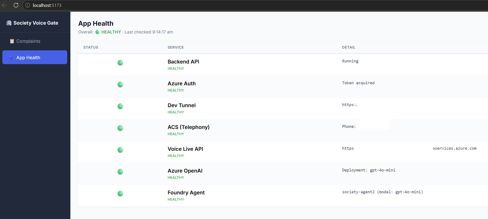

# Society Voice Gate

> **⚠️ NON-PRODUCTION / DEMO ONLY** — This repository is a learning and demonstration project. It is **not** hardened for production workloads. See [Production Considerations](#production-considerations) before deploying beyond local dev.

An **AI-powered voice agent** for residential society helpdesks. Residents call a phone number — or request a callback from the dashboard — and talk to an LLM-driven agent that listens, asks clarifying questions, and — once the call ends — **automatically creates a structured complaint ticket** from the conversation transcript. A live dashboard shows tickets as they arrive.

The agent's persona, voice, and language configuration are managed in **Azure AI Foundry** (no code changes needed to customize). The infrastructure is provisioned via **`azd provision`** (Bicep IaC), and the app runs locally in two containers via Podman/Docker Compose with a Dev Tunnel for public webhook access.

---

## Overview

| What happens | How |
|---|---|
| Resident dials the society helpline | Azure Communication Services (PSTN) — **inbound** |
| _or_ Admin clicks "Call Me" on the dashboard | ACS `create_call()` — **outbound** |
| AI agent answers, converses in natural speech | Voice Live API (real-time ASR + LLM + TTS over a single WebSocket) |
| Agent persona, voice & language come from Foundry | Backend fetches agent config via Foundry REST API at first call |
| Call transcript is accumulated line by line | Backend `voice_service` — bidirectional audio bridge |
| On hang-up, transcript is classified by GPT | `classify_transcript()` → structured JSON |
| A complaint ticket is auto-created | `ticket_service` persists to JSON file |
| Admin views tickets in real time | React dashboard polls `/api/tickets` every 5 s |

**No human operator is needed.** The agent handles the full call, and the ticket appears in the dashboard seconds after the caller hangs up.

---

## Architecture

```
  ┌──────────────┐          ┌──────────────────────────┐
  │  Resident's  │          │  React Dashboard         │
  │    Phone     │          │  (port 5173)             │
  └──────┬───────┘          │  "Call Me" button        │
         │  PSTN call       └────────────┬─────────────┘
         │  (inbound)                    │ POST /api/callback
         │                               │ (outbound)
         ▼                               ▼
  ┌──────────────────────────────────────────────────────┐
  │  Azure Communication Services                        │
  │  Phone Number + Call Automation                      │
  │  (inbound via EventGrid  |  outbound via create_call)│
  └──────┬──────────────────────────────┬────────────────┘
         │ EventGrid webhook            │ Bidirectional
         │ /api/incoming-call           │ audio WebSocket
         ▼                              ▼
  ┌──────────────────────────────────────────────────────┐
  │  FastAPI Backend (port 8000)                         │
  │                                                      │
  │  /api/incoming-call   — answer inbound calls         │
  │  /api/callback        — place outbound calls         │
  │  /api/call-events     — ACS lifecycle callbacks      │
  │  /ws/media            — bidirectional audio bridge   │
  │  /api/tickets         — ticket CRUD                  │
  │                                                      │
  │  On first call:                                      │  ┌─────────────────────────┐
  │    fetch agent config ─────────────────────────────────►│ Azure AI Foundry        │
  │    (instructions, voice, language, VAD)              │  │ Agent REST API          │
  │                                                      │  │ (ai.azure.com/.default) │
  │  During call:                                        │  └─────────────────────────┘
  │    bridge ACS audio ◄──► Voice Live API ─────────────────►┌─────────────────────┐
  │    accumulate transcript                             │    │ Voice Live API      │
  │                                                      │    │ (ASR + GPT + TTS)   │
  │  On disconnect:                                      │    │ model: gpt-4o-mini  │
  │    transcript → classify (GPT) ──────────────────────────►└─────────────────────┘
  │    result → create ticket                            │    ┌─────────────────────┐
  │                                                      │    │ Azure OpenAI        │
  └──────────────────────────────────────────────────────┘    │ chat.completions    │
                                                              └─────────────────────┘
```

### Agent Orchestration Flow

**Inbound call:**
1. **IncomingCall webhook** → backend receives EventGrid event, extracts caller phone number
2. **`answer_call()`** → ACS answers with bidirectional media streaming (PCM 24 kHz mono)

**Outbound call (callback):**
1. Admin enters phone number in dashboard, clicks "Call Me"
2. **`POST /api/callback`** → backend calls `place_outbound_call()`
3. **`create_call()`** → ACS dials the resident from the purchased phone number

**Both flows then converge:**
4. **WebSocket opens** → ACS sends raw audio frames; backend bridges them to Voice Live API
5. **Voice Live session config** → on first call, backend fetches the Foundry agent's instructions and voice-live metadata (voice name, turn detection, transcription languages) via `GET /api/projects/{project}/agents/{agent}`. The config is cached and injected into `session.update`:
   - Agent instructions (from Foundry)
   - Voice (e.g., `en-IN-Meera:DragonHDLatestNeural`)
   - Azure Semantic VAD with configurable thresholds
   - Multilingual transcription (e.g., en-in, hi-in, te-in)
   - Azure Deep Noise Suppression + Server Echo Cancellation
6. **Real-time conversation** — two async tasks run in parallel:
   - `acs_to_vl`: forwards caller audio → Voice Live
   - `vl_to_acs`: forwards TTS audio → ACS, and **accumulates transcript lines** (`Agent: ...` / `Resident: ...`)
7. **Barge-in support** — if the caller starts speaking mid-TTS, a `StopAudio` frame is sent to ACS
8. **CallDisconnected event** → background task:
   - Retrieves full transcript from memory
   - Calls `classify_transcript()` → GPT extracts `{category, sub_category, priority, location, description}`
   - Persists a structured `Complaint` ticket to `data/tickets.json`
9. **Dashboard polls** and the new ticket appears within 5 seconds

### Prompt / Config Structure

- **Agent instructions** — managed in Azure AI Foundry (agent config). Fetched at runtime via REST API. Fallback: `SYSTEM_PROMPT` in `voice_service.py`.
- **Voice & language config** — set in Foundry agent's Voice Live metadata (voice name, transcription languages, turn detection). No code change needed to switch voice or language.
- **`CLASSIFY_PROMPT`** (post-call GPT) — instructs GPT to extract a JSON object with `category`, `sub_category`, `priority`, `location`, and `description` from the raw transcript.

---

## Prerequisites

| Requirement | Version | Notes |
|---|---|---|
| **Azure subscription** | — | Free trial works for demo |
| **Azure CLI** | 2.60+ | `az login` must succeed |
| **Azure Developer CLI (`azd`)** | 1.x+ | For one-command infra provisioning |
| **Python** | 3.12+ | For local dev without containers |
| **Node.js** | 22+ | For frontend local dev |
| **Podman** or **Docker** | 4.x+ / 24+ | For container-based run |
| **Dev Tunnels CLI** | 1.x | Exposes localhost to the internet for ACS webhooks |

Install `azd` if you don't have it:
```bash
curl -fsSL https://aka.ms/install-azd.sh | bash
```

Install Dev Tunnels CLI:
```bash
curl -sL https://aka.ms/DevTunnelCliInstall | bash
```

---

## Quick Start (recommended path)

This is the fastest way to get the full system running. Each step is explained in detail in later sections.

```bash
# 1. Clone the repo
git clone <REPO_URL> && cd society-voice-gate

# 2. Login to Azure
az login

# 3. Provision Azure resources (AI Services, ACS, RBAC)
azd init            # select existing environment or create new
azd provision       # creates resources via Bicep, writes .env files

# 4. Manual steps printed by azd (portal):
#    a. Purchase a phone number: Azure Portal → ACS resource → Phone Numbers
#    b. Create a Foundry agent:  ai.azure.com → Agents → enable Voice mode
#    c. Create EventGrid subscription for IncomingCall → /api/incoming-call
#    d. Set remaining .env values (see output from azd provision)

# 5. Set up a Dev Tunnel
devtunnel user login -d
devtunnel create --allow-anonymous
devtunnel port create -p 8000 --protocol https
devtunnel host <YOUR_TUNNEL_ID>
# Copy the tunnel URL → set CALLBACK_HOST in .env (no trailing slash)

# 6. Start the app
podman-compose up --build    # or: docker compose up --build

# 7. Verify
curl http://localhost:8000/health              # → {"status":"ok"}
open http://localhost:5173                     # → dashboard
# Call the ACS number or use "Call Me" on the dashboard
```

---

## Azure Setup

### Path A — `azd provision` (recommended)

The infrastructure is defined in Bicep under `infra/`. A single command provisions everything:

```bash
azd provision
```

This creates:
- **Azure AI Services** (multi-service) — provides Voice Live API + Azure OpenAI
- **Model deployment** (gpt-4o-mini, GlobalStandard)
- **Azure Communication Services** resource
- **RBAC role assignment** — Cognitive Services User for your identity

After provisioning, `azd` runs `hooks/postprovision.sh` which:
- Fetches the ACS connection string
- Writes both `.env` and `backend/.env` with all provisioned values
- Prints the manual steps you still need to do

### Path B — Manual CLI

If you prefer to create resources individually:

#### Step 1 — Create an Azure AI Services resource

```bash
az cognitiveservices account create \
  --name <YOUR_AI_SERVICES_NAME> \
  --resource-group <YOUR_RG> \
  --kind AIServices \
  --sku S0 \
  --location eastus2 \
  --yes
```

#### Step 2 — Deploy a model

```bash
az cognitiveservices account deployment create \
  --name <YOUR_AI_SERVICES_NAME> \
  --resource-group <YOUR_RG> \
  --deployment-name gpt-4o-mini \
  --model-name gpt-4o-mini \
  --model-version "2024-07-18" \
  --model-format OpenAI \
  --sku-capacity 10 \
  --sku-name GlobalStandard
```

#### Step 3 — Create an ACS resource

```bash
az communication create \
  --name <YOUR_ACS_NAME> \
  --resource-group <YOUR_RG> \
  --data-location unitedstates \
  --location global
```

Then purchase a phone number: Azure Portal → ACS resource → Phone Numbers → Get a number.

#### Step 4 — Grant RBAC roles

```bash
az role assignment create \
  --assignee <YOUR_PRINCIPAL_ID> \
  --role "Cognitive Services User" \
  --scope /subscriptions/<SUB_ID>/resourceGroups/<RG>/providers/Microsoft.CognitiveServices/accounts/<AI_SERVICES_NAME>
```

#### Step 5 — Copy and fill `.env`

```bash
cp .env.example .env
# Edit .env with your values
cp .env backend/.env
```

### Create a Foundry Agent (both paths)

1. Go to **https://ai.azure.com** → your project → **Agents**
2. Create a new agent (e.g., `society-agent`)
3. Set the model (gpt-4o-mini)
4. Write agent instructions (society helpdesk persona)
5. Enable **Voice mode** → configure voice name, transcription languages, turn detection
6. Copy the agent name and project endpoint into `.env`:
   ```
   FOUNDRY_AGENT_NAME=your-agent-name
   FOUNDRY_PROJECT_ENDPOINT=https://<resource>.services.ai.azure.com/api/projects/<project>
   ```

### Wire the IncomingCall Event (both paths)

1. Azure Portal → ACS resource → **Events**
2. Create Event Subscription:
   - **Event type**: `Microsoft.Communication.IncomingCall`
   - **Endpoint type**: Webhook
   - **Endpoint URL**: `https://<YOUR_TUNNEL_URL>/api/incoming-call`

### Set Up Dev Tunnel (both paths)

```bash
devtunnel user login -d                          # one-time auth
devtunnel create --allow-anonymous               # create tunnel
devtunnel port create -p 8000 --protocol https   # map port 8000
devtunnel host <TUNNEL_ID>                       # start hosting
```

Copy the public URL (e.g., `https://abc123-8000.inc1.devtunnels.ms`) and set it as `CALLBACK_HOST` in `.env` (no trailing slash).

---

## Configuration

### `.env` reference

Copy from the template and fill in:
```bash
cp .env.example .env
```

| Variable | Required | Description |
|---|---|---|
| `ACS_CONNECTION_STRING` | ✅ | ACS connection string (from portal or `azd`) |
| `ACS_PHONE_NUMBER` | ✅ | Your ACS phone number in E.164 (e.g., `+xxxxxx`). Used as caller ID for outbound calls. |
| `COGNITIVE_SERVICES_ENDPOINT` | ✅ | AI Services endpoint (e.g., `https://xxx.cognitiveservices.azure.com/`) |
| `VOICE_LIVE_MODEL` | — | Model for Voice Live (default: `gpt-4o-mini`) |
| `FOUNDRY_AGENT_NAME` | — | Foundry agent name. When set, instructions & voice are fetched from Foundry. |
| `FOUNDRY_PROJECT_ENDPOINT` | — | Foundry project endpoint (e.g., `https://<resource>.services.ai.azure.com/api/projects/<project>`) |
| `AZURE_OPENAI_ENDPOINT` | ✅ | OpenAI endpoint for ticket classification (can be same as `COGNITIVE_SERVICES_ENDPOINT`) |
| `AZURE_OPENAI_CHAT_DEPLOYMENT` | — | Chat model deployment name (default: `gpt-4o-mini`) |
| `CALLBACK_HOST` | ✅ | Public URL for ACS webhooks (Dev Tunnel URL, no trailing slash) |
| `LOG_LEVEL` | — | Logging level (default: `INFO`) |

### Authentication Modes

| Mode | When | Setup |
|---|---|---|
| **`az login`** (default) | Local dev | Nothing extra — `compose.yml` mounts `~/.azure` read-only into the container |
| **Service Principal** | CI / staging | Set `AZURE_CLIENT_ID`, `AZURE_CLIENT_SECRET`, `AZURE_TENANT_ID` in `.env` |
| **Managed Identity** | Azure-hosted | Remove the `~/.azure` volume mount from `compose.yml` |

---

## Run Locally

### Option A — Podman / Docker Compose (recommended)

```bash
# 1. Login to Azure (token will be mounted into the container)
az login

# 2. Start a Dev Tunnel (separate terminal)
devtunnel host <YOUR_TUNNEL_ID> --allow-anonymous

# 3. Build and start both containers
podman-compose up --build        # or: docker compose up --build
```

This starts:
- **backend** on `http://localhost:8000` (FastAPI + Uvicorn)
- **frontend** on `http://localhost:5173` (Vite dev server, proxies `/api` → backend)

### Option B — Direct (no containers)

```bash
# Terminal 1 — Dev Tunnel
devtunnel host <YOUR_TUNNEL_ID> --allow-anonymous

# Terminal 2 — Backend
cd society-voice-gate
python3 -m venv .venv && source .venv/bin/activate
pip install -r backend/requirements.txt
cd backend && uvicorn app.main:app --host 0.0.0.0 --port 8000 --reload

# Terminal 3 — Frontend
cd society-voice-gate/frontend
npm install && npm run dev
```

### Verify

```bash
curl http://localhost:8000/health        # → {"status":"ok"}
curl http://localhost:8000/api/tickets   # → []
```

Open `http://localhost:5173` in a browser to see the admin dashboard.

---

## Using the App

### Inbound call (resident calls you)

1. Dial the ACS phone number
2. The agent greets you and asks how it can help
3. Describe a complaint — the agent asks follow-up questions
4. Hang up
5. Within 5–10 seconds, a ticket appears on the dashboard

### Outbound call (you call the resident)

1. Open the dashboard at `http://localhost:5173`
2. Enter a phone number in E.164 format (e.g., `+919876543210`) in the top bar
3. Click **📞 Call Me**
4. The resident's phone rings from your ACS number
5. Same voice agent conversation occurs
6. On hang-up, ticket is auto-created just like an inbound call

### App Health dashboard

The dashboard includes an **App Health** tab that shows the status of every service the system depends on. Click the "App Health" nav item in the sidebar.

| Service | What it checks |
|---|---|
| **Backend API** | FastAPI is responding |
| **Azure Auth** | MSAL credential can acquire a token |
| **Dev Tunnel** | Public callback URL is reachable |
| **ACS (Telephony)** | Connection string + phone number configured |
| **Voice Live API** | Cognitive Services endpoint responds to auth'd request |
| **Azure OpenAI** | Chat completions deployment is live |
| **Foundry Agent** | Agent config can be fetched from Foundry REST API |

Hit the **↻ Refresh** button for on-demand checks. Overall status is `healthy` (all green), `degraded` (some yellow), or `unhealthy` (any red).



---

## Test Scenarios

### Scenario 1 — Lift breakdown (high priority)

> **Caller**: "The passenger lift in Tower B stopped working 30 minutes ago. There's smoke from the motor room."

**Expected ticket**: category=`lift`, priority=`emergency`, location=`Tower B`

### Scenario 2 — Parking dispute (medium priority)

> **Caller**: "Someone keeps parking in my reserved spot B-47."

**Expected ticket**: category=`parking`, priority=`medium`, location=`B-47`

### Scenario 3 — Water leak (high priority)

> **Caller**: "Water leaking from the ceiling, 3rd floor corridor, Tower A."

**Expected ticket**: category=`plumbing`, sub_category=`water leak`, priority=`high`, location=`Tower A, 3rd floor`

---

## Troubleshooting

| Problem | Cause | Fix |
|---|---|---|
| **Busy tone / call drops** | Dev Tunnel not hosting | Run `devtunnel host <ID>` and verify `CALLBACK_HOST` URL |
| **Agent doesn't speak** | Voice Live WebSocket failed | Check logs; verify `COGNITIVE_SERVICES_ENDPOINT` and RBAC role |
| **Agent uses wrong voice/language** | Foundry config not loaded | Set `FOUNDRY_AGENT_NAME` + `FOUNDRY_PROJECT_ENDPOINT` in `.env`; restart |
| **`DefaultAzureCredential` fails in container** | `~/.azure` not mounted | Run `az login` on host before `podman-compose up` |
| **Voice Live returns 401** | Token expired or wrong role | Ensure `Cognitive Services User` role on your AI Services resource |
| **"Call Me" fails with 503** | `ACS_PHONE_NUMBER` not set | Add E.164 number to `.env` and restart |
| **No ticket after call** | Transcript empty or classify failed | Check backend logs for `classify_transcript` errors |
| **Frontend empty** | Backend not running | Verify `curl http://localhost:8000/api/tickets` returns `[]` |
| **EventGrid validation fails** | ACS can't reach tunnel | Ensure tunnel is running and URL matches `CALLBACK_HOST` |
| **`PermissionError: /app/data`** | Volume permissions | `chmod 777 data/` on host, or use a named volume |

---

## Production Considerations

> This demo is not production-ready. Key changes needed:

### Security & Identity
- Replace `az login` with **Managed Identity** on Container Apps / AKS
- Move `ACS_CONNECTION_STRING` to **Azure Key Vault**
- Enable **RBAC-only auth** for ACS (remove access keys)
- Add **API authentication** (Entra ID / OAuth 2.0) to the backend
- Restrict dashboard behind **Entra ID SSO**
- **Restrict CORS** — replace `allow_origins=["*"]` with your frontend domain(s)
- Put the **`/api/health/services`** endpoint behind auth (it reveals infrastructure details)
- Add **rate limiting** to `/api/callback` to prevent outbound-call abuse

### Networking
- Deploy behind **Azure Front Door** with WAF
- Use **private endpoints** for AI Services, ACS, Key Vault
- Replace Dev Tunnel with a proper domain + TLS

### Persistence & Scaling
- Replace JSON file with **Azure Cosmos DB** or **PostgreSQL**
- Run as **Container Apps** with horizontal autoscale
- Move ticket classification to an **async queue** (Service Bus)

### Monitoring
- Add **Azure Application Insights** (OpenTelemetry)
- Set alerts on call failures, Voice Live errors, 5xx rates

---

## Project Structure

```
society-voice-gate/
├── azure.yaml               # azd project config (hooks for provision)
├── compose.yml               # Podman/Docker Compose — backend + frontend
├── Containerfile             # Backend container image (Python 3.12)
├── .env.example              # Environment variable template
├── .gitignore
│
├── infra/                    # Bicep IaC (used by azd provision)
│   ├── main.bicep            # Orchestrator — AI Services, ACS, RBAC
│   ├── main.bicepparam       # Parameters file
│   └── modules/
│       ├── ai-services.bicep
│       ├── communication-services.bicep
│       └── role-assignment.bicep
│
├── hooks/                    # azd lifecycle hooks
│   ├── preprovision.sh       # Resolve signed-in user principal ID
│   └── postprovision.sh      # Write .env files from provisioned values
│
├── backend/
│   ├── requirements.txt
│   └── app/
│       ├── main.py           # FastAPI entry point + CORS
│       ├── config.py          # Pydantic Settings (all env vars)
│       ├── auth.py            # Azure credential + MSAL token provider
│       ├── models.py          # Complaint, TicketCategory, Priority, etc.
│       ├── routers/
│       │   ├── webhooks.py    # ACS events, /api/callback, /ws/media bridge
│       │   ├── tickets.py     # REST API for ticket CRUD
│       │   └── health.py      # Service health checks (/api/health/services)
│       └── services/
│           ├── voice_service.py    # Voice Live bridge + Foundry config + classify
│           └── ticket_service.py   # JSON file persistence
│
├── frontend/
│   ├── Dockerfile
│   ├── package.json
│   ├── vite.config.ts        # Vite dev server + /api proxy
│   └── src/
│       ├── App.tsx            # Dashboard (tickets + health tabs, "Call Me")
│       ├── api.ts             # Axios client (list, update, callback, health)
│       ├── types.ts           # TypeScript interfaces
│       └── components/
│           ├── FilterBar.tsx
│           ├── TicketList.tsx
│           ├── TicketDetail.tsx
│           └── HealthDashboard.tsx  # Service health status table
│
├── data/                     # Persistent ticket store (JSON file, gitignored)
└── screenshots/
```

---

## References

- [Azure AI Foundry — Voice Live API](https://learn.microsoft.com/azure/ai-services/openai/realtime-audio-reference)
- [Azure AI Foundry — Agents](https://learn.microsoft.com/azure/ai-services/agents/overview)
- [Azure Communication Services — Call Automation](https://learn.microsoft.com/azure/communication-services/concepts/call-automation/call-automation)
- [Azure Communication Services — Media Streaming](https://learn.microsoft.com/azure/communication-services/how-tos/call-automation/audio-streaming-quickstart)
- [Azure OpenAI — Chat Completions](https://learn.microsoft.com/azure/ai-services/openai/reference)
- [Azure Developer CLI (`azd`)](https://learn.microsoft.com/azure/developer/azure-developer-cli/overview)
- [Dev Tunnels](https://learn.microsoft.com/azure/developer/dev-tunnels/overview)
- [DefaultAzureCredential](https://learn.microsoft.com/python/api/azure-identity/azure.identity.defaultazurecredential)

---

## License

MIT — see [LICENSE](LICENSE) for details.
