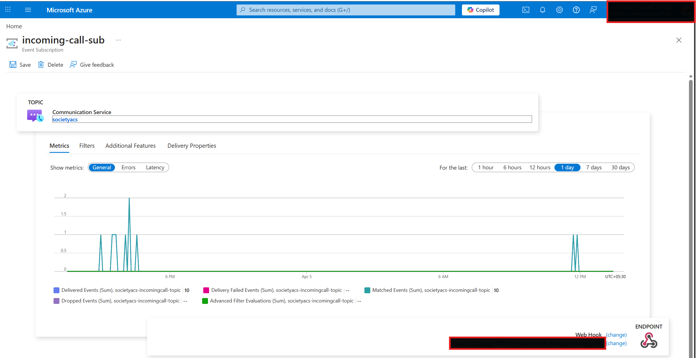

# Society Voice Gate

> **⚠️ NON-PRODUCTION / DEMO ONLY** — This repository is a learning and demonstration project. It is **not** hardened for production workloads. See [Production Considerations](#production-considerations) before deploying beyond local dev.

An **AI-powered voice agent** for residential society helpdesks. Residents call a phone number, talk to an LLM-driven agent that listens, asks clarifying questions, and — once the call ends — **automatically creates a structured complaint ticket** from the conversation transcript. A live dashboard shows tickets as they arrive.

The system is built on an **agentic architecture** using Azure AI Foundry's Voice Live API, Azure Communication Services for telephony, and Azure OpenAI for post-call intelligence. The entire stack runs in two containers via Podman/Docker Compose.

---

## Overview

| What happens | How |
|---|---|
| Resident dials the society helpline | Azure Communication Services (PSTN) |
| AI agent answers, converses in natural speech | Voice Live API (real-time ASR + LLM + TTS over a single WebSocket) |
| Call transcript is accumulated line by line | Backend `voice_service` — bidirectional audio bridge |
| On hang-up, transcript is classified by GPT | `classify_transcript()` → structured JSON |
| A complaint ticket is auto-created | `ticket_service` persists to JSON file |
| Admin views tickets in real time | React dashboard polls `/api/tickets` every 5 s |

**No human operator is needed.** The agent handles the full call, and the ticket appears in the dashboard seconds after the caller hangs up.

---

## Architecture

```
  ┌──────────────┐
  │  Resident's  │
  │    Phone     │
  └──────┬───────┘
         │  PSTN call
         ▼
  ┌──────────────────────────────────┐
  │  Azure Communication Services    │
  │  (Phone Number + Call Automation)│
  └──────┬───────────────┬───────────┘
         │ EventGrid     │ Bidirectional
         │ webhook       │ audio WebSocket
         ▼               ▼
  ┌──────────────────────────────────┐      ┌──────────────────────────┐
  │  FastAPI Backend (port 8000)     │      │  Azure AI Foundry        │
  │                                  │◄────►│  Voice Live API          │
  │  /api/incoming-call  (answer)    │ WSS  │  (ASR + GPT + TTS)       │
  │  /api/call-events    (lifecycle) │      │  model: gpt-4o-mini      │
  │  /ws/media           (audio)     │      └──────────────────────────┘
  │                                  │
  │  On disconnect:                  │      ┌──────────────────────────┐
  │    transcript → classify (GPT)───┼─────►│  Azure OpenAI            │
  │    result     → create ticket    │      │  chat.completions.create │
  │                                  │      └──────────────────────────┘
  └──────────────┬───────────────────┘
                 │  GET /api/tickets
                 ▼
  ┌──────────────────────────────────┐
  │  React Dashboard (port 5173)     │
  │  Polls every 5 s, shows tickets  │
  └──────────────────────────────────┘
```

### Agent Orchestration Flow (step by step)

1. **IncomingCall webhook** → backend receives EventGrid event, extracts caller phone number
2. **answer_call()** → ACS Call Automation answers with bidirectional media streaming (PCM 24 kHz mono)
3. **WebSocket opens** → ACS sends raw audio frames; backend bridges them to Voice Live API over a second WebSocket
4. **Voice Live session config** → backend sends `session.update` with:
   - System prompt (concise society helpdesk persona)
   - Azure Semantic VAD (voice activity detection, 200 ms silence threshold)
   - Azure Deep Noise Suppression
   - Server-side echo cancellation
   - HD neural voice (`en-US-Aria:DragonHDLatestNeural`)
5. **Real-time conversation** — two async tasks run in parallel:
   - `acs_to_vl`: forwards caller audio → Voice Live
   - `vl_to_acs`: forwards TTS audio → ACS, and **accumulates transcript lines** (`Agent: ...` / `Resident: ...`)
6. **Barge-in support** — if the caller starts speaking mid-TTS, a `StopAudio` frame is sent to ACS immediately
7. **CallDisconnected event** → background task fires:
   - Retrieves full transcript from memory
   - Calls `classify_transcript()` → GPT extracts `{category, sub_category, priority, location, description}`
   - Persists a structured `Complaint` ticket to `data/tickets.json`
8. **Dashboard polls** and the new ticket appears within 5 seconds

### Tools / Functions Used by the Agent

| Component | Purpose |
|---|---|
| **Voice Live API** | Single-WebSocket real-time ASR + LLM reasoning + TTS — the agent's "brain and voice" |
| **ACS Call Automation SDK** | Telephony orchestration — answer calls, manage media streams, receive lifecycle events |
| **Azure OpenAI `chat.completions`** | Post-call transcript classification — extracts structured complaint fields |
| **`ticket_service`** | File-based CRUD persistence with thread-safe JSON writes |

### Prompt / Config Structure

The system uses two distinct prompts:

- **`SYSTEM_PROMPT`** (Voice Live session) — instructs the agent to be a concise society helpdesk assistant, ask one question at a time, and keep responses under two sentences.
- **`CLASSIFY_PROMPT`** (post-call GPT) — instructs GPT to extract a JSON object with `category`, `sub_category`, `priority`, `location`, and `description` from the raw transcript. No free text — JSON only.

Both prompts live in `backend/app/services/voice_service.py` and can be edited without touching any other code.


---

## Prerequisites

| Requirement | Version | Notes |
|---|---|---|
| **Azure subscription** | — | Free trial works for demo |
| **Azure CLI** | 2.60+ | `az login` must succeed |
| **Python** | 3.12+ | For local dev without containers |
| **Node.js** | 22+ | For frontend local dev |
| **Podman** or **Docker** | 4.x+ / 24+ | For container-based run |
| **Dev Tunnels CLI** | 1.x | Exposes localhost to the internet for ACS webhooks |

---

## Azure Setup

> **Do this first.** The agent needs three Azure resources wired together.

### Step 1 — Create an Azure AI Services (multi-service) resource

This single resource provides both the **Voice Live API** and the **Azure OpenAI** chat endpoint.

```bash
az cognitiveservices account create \
  --name <YOUR_AI_SERVICES_NAME> \
  --resource-group <YOUR_RG> \
  --kind AIServices \
  --sku S0 \
  --location eastus2 \
  --yes
```

### Step 2 — Deploy a model

```bash
az cognitiveservices account deployment create \
  --name <YOUR_AI_SERVICES_NAME> \
  --resource-group <YOUR_RG> \
  --deployment-name gpt-4o-mini \
  --model-name gpt-4o-mini \
  --model-version "2024-07-18" \
  --model-format OpenAI \
  --sku-capacity 10 \
  --sku-name GlobalStandard
```

### Step 3 — Create an Azure Communication Services resource

```bash
az communication create \
  --name <YOUR_ACS_NAME> \
  --resource-group <YOUR_RG> \
  --data-location unitedstates \
  --location global
```

Then purchase a phone number via the Azure Portal → ACS resource → Phone Numbers → Get a number.

### Step 4 — Wire the IncomingCall event

In the Azure Portal:
1. Go to your ACS resource → **Events**
2. Create an Event Subscription:
   - **Event type**: `Microsoft.Communication.IncomingCall`
   - **Endpoint type**: Webhook
   - **Endpoint URL**: `https://<YOUR_TUNNEL_URL>/api/incoming-call`



### Step 5 — Configure the ACS callback URL

ACS call events (connected, disconnected, media streaming) are delivered to the URL you pass in `answer_call()`. This is controlled by the `CALLBACK_HOST` environment variable.

### Step 6 — Grant RBAC roles

Your identity (or service principal) needs these roles on the AI Services resource:

```bash
# Cognitive Services User — needed for Voice Live API + OpenAI
az role assignment create \
  --assignee <YOUR_PRINCIPAL_ID> \
  --role "Cognitive Services User" \
  --scope /subscriptions/<SUB_ID>/resourceGroups/<RG>/providers/Microsoft.CognitiveServices/accounts/<AI_SERVICES_NAME>
```

---

## Configuration

Copy the example and fill in your values:

```bash
cp .env.example .env
```

**.env** (use placeholders — never commit real secrets):

```env
# Azure Communication Services
ACS_CONNECTION_STRING=endpoint=https://<YOUR_ACS>.unitedstates.communication.azure.com/;accesskey=<YOUR_KEY>

# Azure AI Services — Voice Live API
COGNITIVE_SERVICES_ENDPOINT=https://<YOUR_AI_SERVICES>.cognitiveservices.azure.com/
VOICE_LIVE_MODEL=gpt-4o-mini

# Azure OpenAI — post-call transcript classification
AZURE_OPENAI_ENDPOINT=https://<YOUR_AI_SERVICES>.cognitiveservices.azure.com/
AZURE_OPENAI_CHAT_DEPLOYMENT=gpt-4o-mini

# Public callback URL (Dev Tunnel or deployed domain)
CALLBACK_HOST=https://<YOUR_TUNNEL_URL>
LOG_LEVEL=INFO
```

### Authentication Modes

| Mode | When to use | What to set |
|---|---|---|
| **`az login`** (default) | Local development | Nothing extra — compose mounts `~/.azure` read-only |
| **Service Principal** | CI / staging | Set `AZURE_CLIENT_ID`, `AZURE_CLIENT_SECRET`, `AZURE_TENANT_ID` in `.env` |
| **Managed Identity** | Azure-hosted (Container Apps, AKS) | Remove the `~/.azure` volume mount from `compose.yml` |

### Secret Management Best Practices

- **Never** commit `.env` to source control (it's in `.gitignore`)
- In production, store secrets in **Azure Key Vault** and reference them via managed identity
- For ACS, prefer connection-string rotation or move to RBAC-based auth
- Use `AZURE_CLIENT_SECRET` only in non-interactive environments; prefer certificate-based auth where possible

---

## Run Locally (non-prod)

### Option A — Podman / Docker Compose (recommended)

```bash
# 1. Login to Azure (token will be mounted into the container)
az login

# 2. Start a Dev Tunnel to expose port 8000
devtunnel host <YOUR_TUNNEL_ID> --allow-anonymous
# Note the public URL and set it as CALLBACK_HOST in .env

# 3. Build and start both containers
cd society-voice-gate
podman-compose up --build        # or: docker compose up --build
```

This starts:
- **backend** on `http://localhost:8000` (FastAPI + Uvicorn)
- **frontend** on `http://localhost:5173` (Vite dev server, proxies `/api` → backend)

### Option B — Direct (no containers)

```bash
# Terminal 1 — Dev Tunnel
devtunnel host <YOUR_TUNNEL_ID> --allow-anonymous

# Terminal 2 — Backend
cd society-voice-gate
python3 -m venv .venv && source .venv/bin/activate
pip install -r backend/requirements.txt
cd backend && uvicorn app.main:app --host 0.0.0.0 --port 8000 --reload

# Terminal 3 — Frontend
cd society-voice-gate/frontend
npm install && npm run dev
```

### Verify

```bash
curl http://localhost:8000/health        # → {"status":"ok"}
curl http://localhost:8000/api/tickets   # → []
curl http://localhost:5173/api/tickets   # → [] (proxy works)
```

Open `http://localhost:5173` in a browser to see the admin dashboard.


---

## Test Scenarios

### Scenario 1 — Lift breakdown (high priority)

> **Caller**: "Hello, my name is Rekha from Tower B, flat 502. The passenger lift stopped working about 30 minutes ago."
>
> **Agent**: "What specific details can you provide about the lift issue, such as when it stopped working?"
>
> **Caller**: "It stopped around 10:30 AM and there's smoke coming from the motor room."
>
> **Agent**: "I will report the lift malfunction and potential fire hazard immediately. Please confirm you are in a safe location."

**Expected ticket**:
- Category: `lift`
- Sub-category: `lift malfunction with smoke`
- Priority: `emergency`
- Location: `Tower B, flat 502`

### Scenario 2 — Parking dispute (medium priority)

> **Caller**: "Someone keeps parking in my reserved spot, B-47. This is the third time this week."

**Expected ticket**:
- Category: `parking`
- Priority: `medium`
- Location: `B-47`

### Scenario 3 — Water leak (high priority)

> **Caller**: "There's water leaking from the ceiling in the corridor on the 3rd floor of Tower A."

**Expected ticket**:
- Category: `plumbing`
- Sub-category: `water leak`
- Priority: `high`
- Location: `Tower A, 3rd floor`

### How to verify

1. Call the ACS phone number
2. Have a conversation with the agent
3. Hang up
4. Within 5–10 seconds, check the dashboard at `http://localhost:5173`
5. The ticket should appear with the correct category, priority, and a clean description


---

## Troubleshooting

| Problem | Cause | Fix |
|---|---|---|
| **No transcript / ticket after call** | Call ID mismatch between answer and WebSocket | Already fixed — `resolve_call_id()` uses a FIFO queue to map IDs correctly |
| **`PermissionError: /app/data/tickets.json`** | Host `data/` dir owned by root, container runs as non-root | `chmod 777 data/` on the host, or use a named volume |
| **`Login required to host existing tunnel`** | Dev Tunnel token expired | Run `devtunnel user login -d` and complete the device-code flow |
| **`DefaultAzureCredential` fails in container** | `~/.azure` not mounted or empty | Run `az login` on the host before `podman-compose up` |
| **Voice Live returns 401** | Token expired or wrong RBAC role | Ensure `Cognitive Services User` role is assigned to your identity |
| **Call rings but agent doesn't speak** | WebSocket to Voice Live failed to connect | Check backend logs for connection errors; verify `COGNITIVE_SERVICES_ENDPOINT` |
| **Frontend shows empty dashboard** | Backend not running or proxy misconfigured | Verify `curl http://localhost:8000/api/tickets` returns `[]` |
| **EventGrid webhook validation fails** | ACS can't reach your tunnel URL | Ensure Dev Tunnel is hosting and the URL matches `CALLBACK_HOST` |

---

## Production Considerations

> This demo cuts corners that production systems cannot. Here's what changes.

### Security & Identity

- Replace `az login` token mounting with **Managed Identity** (system-assigned on Container Apps / AKS)
- Move `ACS_CONNECTION_STRING` to **Azure Key Vault**; reference via Key Vault secret URI
- Enable **RBAC-only auth** for ACS (remove access keys entirely)
- Add **API authentication** to the backend (e.g., Entra ID / OAuth 2.0 bearer tokens)
- Restrict the admin dashboard behind **Entra ID SSO**

### Networking

- Deploy behind **Azure Front Door** or **Application Gateway** with WAF
- Use **private endpoints** for AI Services, ACS, and Key Vault — no public internet exposure
- Place backend containers in a **VNet-integrated** Container Apps environment or AKS cluster
- Remove Dev Tunnel — use a proper domain with TLS termination

### Monitoring & Observability

- Integrate **Azure Application Insights** (OpenTelemetry SDK) for distributed tracing
- Ship structured logs to **Azure Monitor / Log Analytics**
- Set up **alerts** on: call failures, Voice Live errors, ticket classification failures, 5xx rates
- Track **custom metrics**: calls per hour, avg call duration, ticket classification accuracy

### Scaling

- Replace JSON file persistence with **Azure Cosmos DB** or **PostgreSQL** for concurrent writes
- Run backend as a **Container Apps** revision with horizontal autoscale (scale on HTTP concurrency)
- Move ticket classification to an **async queue** (Service Bus / Event Grid) so call-event responses are instant
- Add **retry with exponential backoff** for Voice Live and OpenAI calls

### CI/CD & Deployment

- Use **Azure Developer CLI (`azd`)** or **GitHub Actions** for automated deployments
- Add Bicep / Terraform templates for all Azure resources (IaC)
- Run linting (`ruff`), type checking (`mypy`), and tests in CI before merge
- Use **container image scanning** (Trivy / Defender for Containers) in the build pipeline
- Implement **blue-green** or **canary** deployments for zero-downtime releases

---

## Project Structure (quick reference)

```
society-voice-gate/
├── compose.yml              # Podman/Docker Compose — backend + frontend
├── Containerfile            # Backend container image (Python 3.12)
├── .env.example             # Environment variable template
├── .gitignore
│
├── backend/
│   ├── requirements.txt
│   └── app/
│       ├── main.py          # FastAPI app entry point
│       ├── config.py         # Pydantic Settings (env vars)
│       ├── auth.py           # DefaultAzureCredential + token provider
│       ├── models.py         # Complaint, TicketCategory, Priority, etc.
│       ├── routers/
│       │   ├── webhooks.py   # ACS events + WebSocket audio bridge
│       │   └── tickets.py    # REST API for ticket CRUD
│       └── services/
│           ├── voice_service.py    # Voice Live bridge + transcript + classify
│           └── ticket_service.py   # JSON file persistence
│
├── frontend/
│   ├── Dockerfile
│   ├── package.json
│   ├── vite.config.ts       # Vite dev server + /api proxy
│   └── src/
│       ├── App.tsx           # Main dashboard (polling, filters, summary cards)
│       ├── api.ts            # Axios client
│       ├── types.ts          # TypeScript interfaces
│       └── components/
│           ├── FilterBar.tsx
│           ├── TicketList.tsx
│           └── TicketDetail.tsx
│
├── data/                    # Persistent ticket store (JSON file)
└── screenshots/             # Add architecture & demo screenshots here
```

---

## References

- [Azure AI Foundry — Voice Live API](https://learn.microsoft.com/azure/ai-services/openai/realtime-audio-reference)
- [Azure Communication Services — Call Automation](https://learn.microsoft.com/azure/communication-services/concepts/call-automation/call-automation)
- [Azure Communication Services — Media Streaming](https://learn.microsoft.com/azure/communication-services/how-tos/call-automation/audio-streaming-quickstart)
- [Azure OpenAI — Chat Completions](https://learn.microsoft.com/azure/ai-services/openai/reference)
- [DefaultAzureCredential](https://learn.microsoft.com/python/api/azure-identity/azure.identity.defaultazurecredential)
- [Podman Compose](https://github.com/containers/podman-compose)

### Inspired by (not a clone)

This project was inspired by — but is architecturally distinct from — these repositories:

| Repository | How this project differs |
|---|---|
| [ss4aman/india-call-center-voice-agent](https://github.com/ss4aman/india-call-center-voice-agent) | That project targets a Hindi-language banking IVR with Azure Container Apps + `azd` deployment. **Society Voice Gate** is domain-specific to residential society operations, uses a different orchestration approach (bidirectional WebSocket bridge with transcript accumulation), and adds **automatic post-call ticket creation** via GPT classification — a feature not present in the reference. |
| [Azure-Samples/call-center-voice-agent-accelerator](https://github.com/Azure-Samples/call-center-voice-agent-accelerator) | The accelerator is an enterprise reference architecture deployed on Azure Container Apps with ACR, Key Vault, and Bicep IaC via `azd up`. It handles real-time voice-in/voice-out but has no post-call processing. **Society Voice Gate** adds automatic transcript accumulation, GPT-powered ticket classification, a persistent ticket store, and a React admin dashboard — demonstrating what happens *after* the call ends. |

All code in this repository is original.

---

## License

MIT — see [LICENSE](LICENSE) for details.
