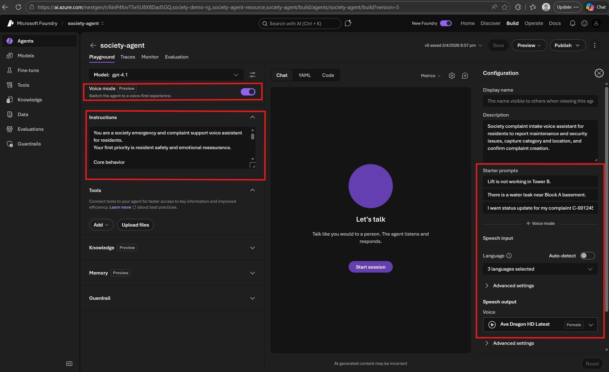
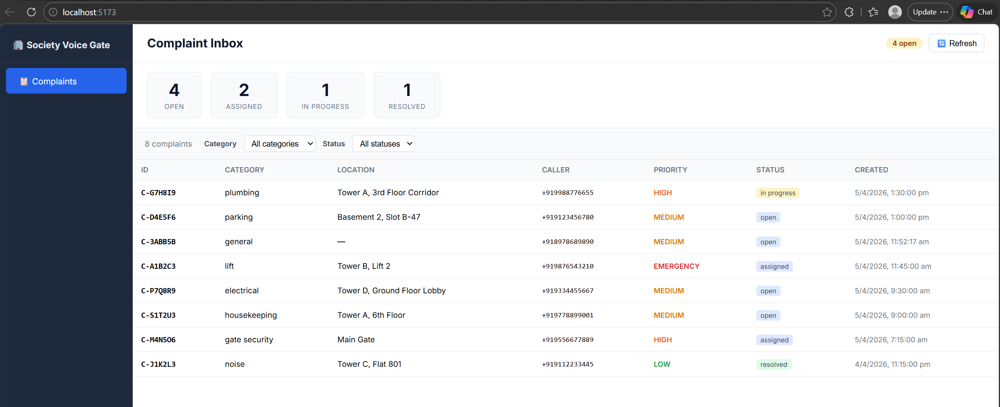
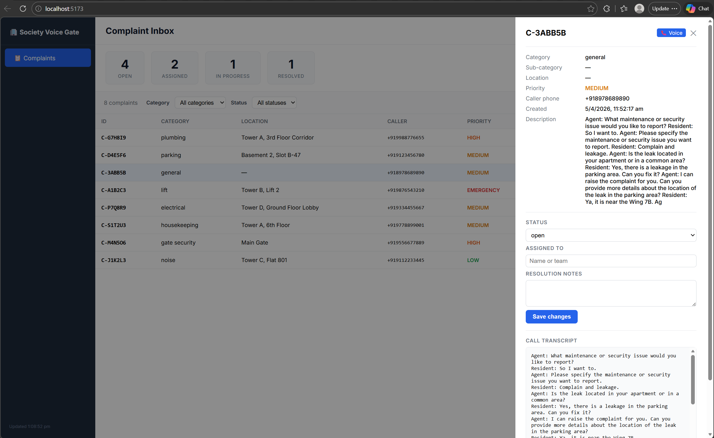

# Building an AI Voice Helpdesk Agent on Azure

## Using Azure AI Foundry's Voice Live API, Azure Communication Services, and GPT to build an end-to-end agentic voice system for a residential society helpdesk

---

Imagine this: a resident in your housing society calls a helpline number to report a broken lift. An AI agent picks up, has a natural conversation, asks clarifying questions — and the moment the caller hangs up, a structured complaint ticket appears on an admin dashboard. No hold music. No human operator. No manual data entry.

This is exactly what **Society Voice Gate** delivers.

---

## The Problem

Residential societies in India deal with dozens of daily complaints — parking disputes, plumbing leaks, security issues, noise violations. Most societies rely on WhatsApp groups, paper registers, or overworked security guards to log these. Things fall through the cracks. Residents get frustrated. Nobody knows the status of anything.

Some try to solve this with ticketing apps, but residents hate them. Even a few taps to open an app, enter details, and submit — why bother when you can just *say* the problem? A simple phone call where an agent listens, asks the right questions, and actually *understands* context feels natural. Like talking to a human receptionist. But available 24/7.

What if the helpdesk itself was an AI agent?

---

## The System

**Society Voice Gate** is an AI-powered voice agent for residential society helpdesks. Here's the flow:

1. **Resident dials the society helpline** (a real phone number via Azure Communication Services)
2. **An AI agent answers** — powered by Azure AI Foundry's Voice Live API, it listens and responds in natural speech
3. **The conversation transcript is accumulated** line by line during the call
4. **On hang-up**, GPT classifies the transcript into a structured complaint — extracting category, priority, location, and description
5. **A ticket is auto-created** and appears on a live React dashboard within seconds

No human in the loop. The agent handles the full call, and the ticket materializes on the dashboard.

---

## The Architecture

The system has three main pieces: telephony, the voice agent, and post-call intelligence.

```
  Resident's Phone
        │  PSTN call
        ▼
  Azure Communication Services
  (Phone Number + Call Automation)
        │
        ▼
  FastAPI Backend ◄──── WSS ────► Azure AI Foundry Voice Live API
  (answer call, bridge audio,       (real-time ASR + LLM + TTS)
   accumulate transcript)
        │
        │ On disconnect:
        │   transcript → GPT → structured JSON
        │   result → create ticket
        ▼
  React Dashboard
  (polls every 5s, shows tickets)
```

The interesting part is the **bidirectional WebSocket bridge**. When a call comes in:

- ACS answers and opens a WebSocket sending raw audio (PCM 24 kHz mono)
- The backend opens a *second* WebSocket to Voice Live API
- Two async tasks run in parallel:
  - **`acs_to_vl`**: forwards caller audio → Voice Live
  - **`vl_to_acs`**: forwards TTS audio → ACS, and accumulates transcript lines (`Agent: ...` / `Resident: ...`)
- It even handles **barge-in** — if the caller speaks mid-sentence, a `StopAudio` frame cuts the TTS immediately

The Voice Live API is doing the heavy lifting here: speech recognition, LLM reasoning, and text-to-speech — all over a single WebSocket connection. This eliminates the need for separate ASR and TTS services.

---

## The Agent's Personality

The agent uses two distinct prompts:

**During the call** — a `SYSTEM_PROMPT` that instructs it to be a concise society helpdesk assistant. Ask one question at a time. Keep responses under two sentences. Focus on safety first.

**After the call** — a `CLASSIFY_PROMPT` that tells GPT to extract a JSON object with `category`, `sub_category`, `priority`, `location`, and `description` from the raw transcript. No free text — JSON only.

The Voice Live session is configured with:
- Azure Semantic VAD (voice activity detection, 200ms silence threshold)
- Azure Deep Noise Suppression (because phone calls are noisy)
- Server-side echo cancellation
- HD neural voice (`en-US-Aria:DragonHDLatestNeural`)

Here's what the agent configuration looks like in Microsoft Foundry's playground:



---

## The Magic Moment: Auto-Ticket Creation

When a caller hangs up, ACS fires a `CallDisconnected` event. The backend catches this and kicks off a background task:

1. Retrieve the full transcript from memory
2. Call `classify_transcript()` — sends the transcript to Azure OpenAI's `chat.completions` endpoint
3. GPT returns a structured JSON with category (from 10 predefined types like `lift`, `plumbing`, `parking`, `noise`), priority, location, and description
4. Persist as a `Complaint` ticket to the data store

The ticket appears on the dashboard within 5 seconds of hanging up.

### Real Example

Here's an example call:

> **Caller**: "Hello, there's water leaking from the ceiling in the corridor on the 3rd floor of Tower A."
>
> **Agent**: "How severe is the leak?"
>
> **Caller**: "It's a steady drip, the floor is getting quite slippery. I think it's coming from flat 402 above."
>
> **Agent**: "I'll dispatch the plumber immediately. We'll also place caution signs in the corridor."

After hanging up, this ticket was auto-created:
- **Category**: `plumbing`
- **Sub-category**: `water leak from ceiling`
- **Priority**: `high`
- **Location**: `Tower A, 3rd Floor Corridor`

---

## The Dashboard

The frontend is a React + TypeScript dashboard built with Vite. It polls `/api/tickets` every 5 seconds and shows:

- Summary cards (open, assigned, in progress, resolved)
- Filterable ticket list by category and status
- A slide-over detail view with the full call transcript



Clicking any ticket opens a detail panel with the full conversation transcript, status management, and assignment fields:



---

## The Wiring: ACS EventGrid

A key piece of the puzzle is wiring Azure Communication Services to the backend. When someone calls the ACS phone number, an `IncomingCall` event is fired via EventGrid to the webhook endpoint.

For local development, a **Dev Tunnel** exposes localhost to the internet. The EventGrid subscription points to the tunnel URL:


---

## A Bug That Almost Killed the Demo

The first live call worked perfectly — the AI agent answered, had a natural conversation, everything sounded great. But no ticket was created.

The issue? **Call ID mismatch.**

When ACS answers a call, `answer_call()` returns a `callConnectionId`. But when the WebSocket opens, ACS sends an `AudioMetadata` message with a different `subscriptionId`. The transcript is stored under the WebSocket ID, but the `CallDisconnected` event looks up the answer ID — creating a mismatch.

The fix: a FIFO queue (`_pending_call_ids`) that maps WebSocket connections to their original call IDs via a `resolve_call_id()` function. Simple in hindsight, but it took staring at logs for a while.

---

## Tech Stack

| Layer | Technology |
|---|---|
| **Telephony** | Azure Communication Services (PSTN + Call Automation SDK) |
| **Voice Agent** | Azure AI Foundry Voice Live API (ASR + GPT + TTS over WebSocket) |
| **Post-call Intelligence** | Azure OpenAI `chat.completions` (transcript → structured JSON) |
| **Backend** | Python 3.12, FastAPI, Uvicorn |
| **Frontend** | React 19, TypeScript, Vite, Axios |
| **Auth** | `DefaultAzureCredential` (supports `az login`, Service Principal, Managed Identity) |
| **Containers** | Podman Compose (backend + frontend) |
| **Persistence** | JSON file with thread-safe locking (demo-grade) |

---

## What Makes This Different?

Society Voice Gate was inspired by the [Azure-Samples/call-center-voice-agent-accelerator](https://github.com/Azure-Samples/call-center-voice-agent-accelerator) and [ss4aman/india-call-center-voice-agent](https://github.com/ss4aman/india-call-center-voice-agent), but is architecturally distinct:

- **Post-call intelligence** — the accelerator handles real-time voice-in/voice-out but has no post-call processing. Society Voice Gate adds automatic transcript accumulation and GPT-powered ticket classification.
- **Domain-specific** — built for residential society operations (10 complaint categories like lift, plumbing, parking, noise, gate security) rather than generic banking IVR.
- **Full-stack** — includes a React admin dashboard with live polling, filters, and ticket management. The reference repos have no UI beyond a test page.
- **Minimal infrastructure** — runs in two containers via `podman-compose`. No Azure Container Apps, no ACR, no Bicep required for local dev.

---

## Key Takeaways

1. **Voice Live API is powerful.** Having ASR + LLM + TTS over a single WebSocket eliminates a lot of orchestration complexity. You don't need separate speech-to-text and text-to-speech services.

2. **Barge-in matters.** If you don't handle interruption, the agent sounds robotic. Sending `StopAudio` when the caller starts speaking makes conversations feel natural.

3. **Call IDs are tricky.** ACS uses different identifiers at different stages of the call lifecycle. Always log everything and don't assume IDs will match across events.

4. **Semantic VAD > fixed timers.** The Azure Semantic VAD with 200ms silence threshold works much better than fixed silence detection for natural conversation flow.

5. **Post-call processing is the real value.** The voice conversation is impressive, but the automatic ticket creation is what makes this actually useful. The call is just the input — the structured output is what matters.

---

## Try It Yourself

The entire project is open source:

**GitHub**: [github.com/vrajakishore/society-voice-gate](https://github.com/vrajakishore/society-voice-gate)

You'll need an Azure subscription with:
- An Azure AI Services resource (for Voice Live API + OpenAI)
- An Azure Communication Services resource (with a phone number)
- A Dev Tunnel for local webhook delivery

The README has step-by-step setup instructions, test scenarios, and troubleshooting tips.

> **Note**: This is a demo/learning project, not production-ready. See the repo's Production Considerations section for what you'd change before deploying for real.

---

## What's Next?

Potential enhancements include:

- **Multi-language support** — Hindi + English code-switching is common in Indian societies
- **Async ticket classification** via Service Bus for instant call-event responses
- **Azure Cosmos DB** for persistence instead of JSON files
- **Deploying to Azure Container Apps** with `azd up` and Bicep IaC
- **Application Insights** integration for distributed tracing across the voice pipeline

---

*Have experience building voice agents on Azure? Share your insights in the comments below.*

---

**Tags**: `#Azure` `#AI` `#VoiceAgent` `#AzureCommunicationServices` `#AzureOpenAI` `#FastAPI` `#React` `#AgenticAI` `#VoiceLiveAPI`
